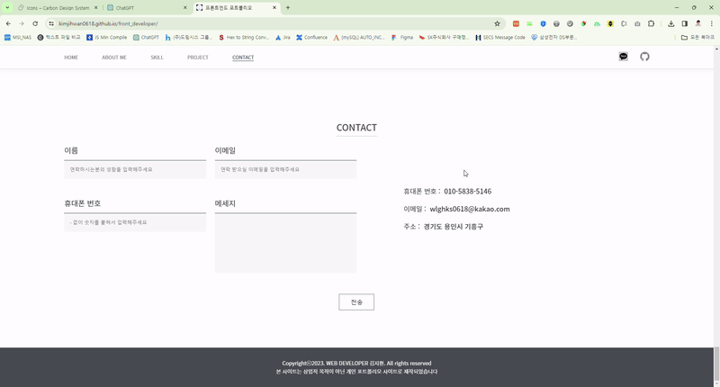

# 프론트엔드 개발 포트폴리오 렌딩페이지
🔗 <a href="https://kimjihwan0618.github.io/front_developer/" target="_blank">사이트 링크</a>


## 개요
이 프로젝트는 Vue.js 3와 Vuex 문법, ph-ages 배포를 연습하기 위해 만들어진 포트폴리오 페이지입니다.


## 설치, 실행, 빌드, 배포 방법
1. 저장소 클론

``
git clone https://github.com/kimjihwan0618/front_developer.git
``

2. 필요한 패키지 설치

``
npm i
``

3. 로컬 개발 서버 실행

``
npm run dev
``

4. 앱 빌드

``
npm run generate
``

5. 앱 배포 

``
npm run deploy
``


## 기능
- 스크롤 위치에 따라 프로젝트 아이템이 나타나고, 스크롤이 벗어나면 아이템이 사라지는 애니메이션을 적용.


-페이지 맨 하단에는 메일 폼이 있으며, 이를 통해 메일을 전송할 경우, 

[mypopol_admin_be 프로젝트](https://github.com/kimjihwan0618/mypopol_admin_be/blob/main/controllers/emailCtrl.js)의 `sendMail` 실행.




## 환경 변수 설정

배포할 때 사용할 환경 변수를 설정해야 합니다.

이를 위해 `.env.production` 파일을 프로젝트 루트 디렉토리에 생성하고 다음과 같이 환경 변수를 추가합니다.

아래에는 [mypopol_admin_be 프로젝트](https://github.com/kimjihwan0618/mypopol_admin_be.js)가 실행되고있는 호스트 주소를 적어줍니다.
```plaintext
MAIL_API_URL=https://example-host.com:3000